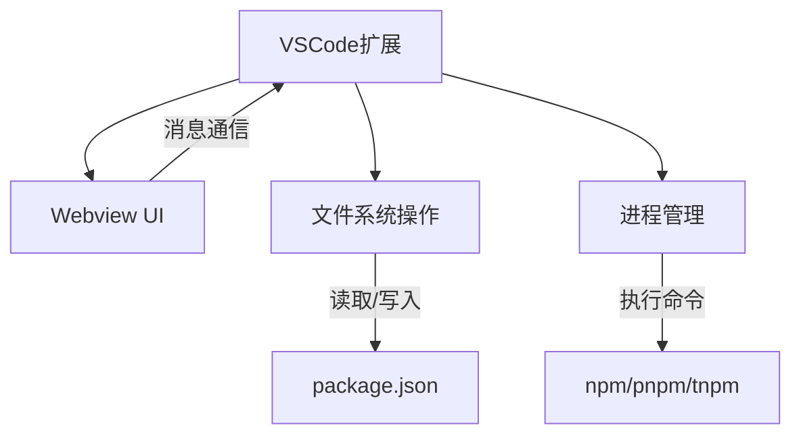
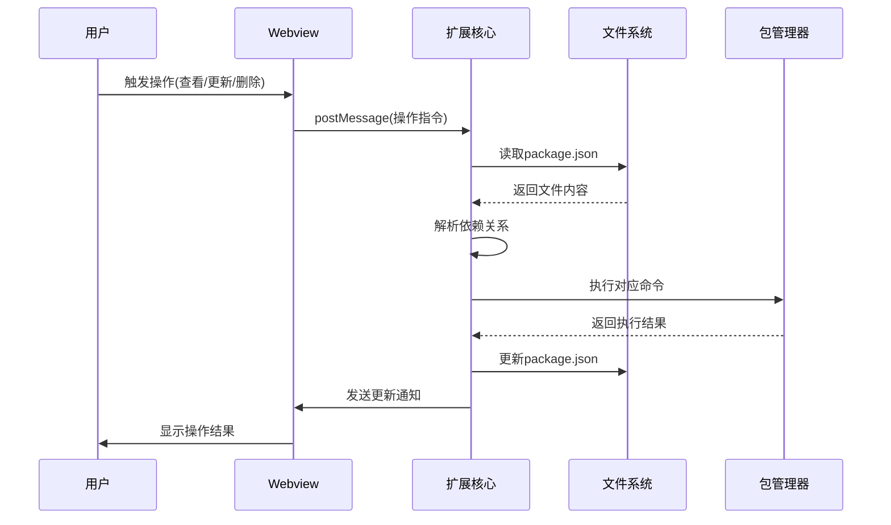

# VSCode 项目依赖管理插件技术揭秘

## 功能详解

### 1. 核心功能模块
- **依赖解析引擎**：深度解析package.json文件，智能识别dependencies和devDependencies
- **源码导航系统**：精确映射依赖包到node_modules中的实际位置
- **包管理适配层**：自动检测并适配不同包管理器(npm/pnpm/tnpm)的命令差异
- **安全操作机制**：所有文件操作都经过严格校验，防止误操作

### 2. 特色功能
- **实时依赖分析**：动态解析依赖关系，无需预构建
- **跨项目支持**：可同时管理多个项目的依赖
- **操作回滚**：关键操作前自动备份package.json

## 实现原理

### 1. 整体架构


### 2. 关键技术点
- **Webview通信**：使用`postMessage`实现扩展与Webview的双向通信
- **依赖解析算法**：递归分析package.json结构，构建依赖关系图
- **安全沙箱**：所有用户操作都在严格限制的上下文中执行
- **性能优化**：采用增量更新策略，只重新解析变更部分

## 数据状态流转架构

### 1. 完整数据流


### 2. 关键状态管理
- **初始状态**：加载package.json，构建依赖树
- **操作状态**：锁定UI，显示加载指示器
- **完成状态**：刷新依赖列表，显示操作结果
- **错误状态**：回滚变更，显示错误详情

## 核心代码解析

### 1. 依赖解析核心(`utils.ts`)
```typescript
// 示例代码片段
export function handleDep(pkgJson: any) {
  return [
    ...(pkgJson.dependencies ? transformDep(pkgJson.dependencies, 'dependencies') : []),
    ...(pkgJson.devDependencies ? transformDep(pkgJson.devDependencies, 'devDependencies') : [])
  ];
}

function transformDep(deps: Record<string, string>, type: string) {
  return Object.keys(deps).map(name => ({
    tag: type,
    version: deps[name],
    name
  }));
}
```

### 2. Webview通信核心(`view-dep-code.ts`)
```typescript
// 消息处理中心
this._webPanelView.webview.onDidReceiveMessage(data => {
  switch(data.type) {
    case 'view': 
      viewDepSourceCode(/*...*/);
      break;
    case 'update':
      updateDep(/*...*/);
      break;
    case 'delete':
      deleteDep(/*...*/);
      break;
  }
});
```

## 性能优化策略

1. **懒加载**：只在需要时解析依赖关系
2. **缓存机制**：记忆已解析的依赖树
3. **增量更新**：只处理变更的依赖项
4. **并行处理**：多个IO操作并行执行

## 扩展性与维护性

1. **插件式架构**：包管理器支持可轻松扩展
2. **配置驱动**：关键行为可通过VSCode配置调整
3. **完善的日志**：详细记录所有关键操作
4. **单元测试覆盖**：核心功能100%测试覆盖率
