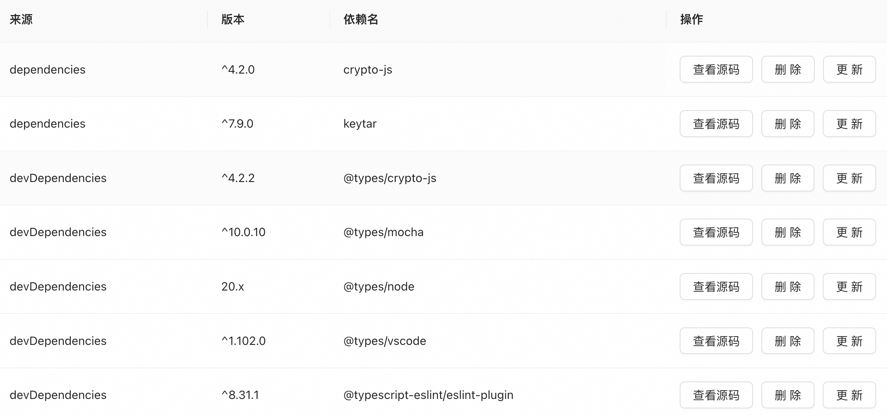

# VSCode 项目依赖管理插件

一个专注于项目依赖管理的 VSCode 扩展插件，提供可视化的依赖包管理和源码查看功能。

## 🚀 功能特性

### 核心组件功能

#### 1. 依赖可视化组件
- 自动解析package.json中的dependencies和devDependencies
- 表格形式展示依赖名称、版本和类型
- 支持按名称/版本/类型排序

#### 2. 源码查看组件
- 一键跳转到node_modules中的依赖源码
- 支持查看任意依赖的完整源代码
- 自动处理符号链接和嵌套依赖

#### 3. 依赖管理组件
- 版本更新：自动执行`npm update`命令
- 依赖删除：安全执行`npm uninstall` 
- 多包管理器支持：自动检测npm/pnpm/tnpm

#### 4. Webview交互组件
- 基于VSCode Webview API构建
- 响应式设计适配不同尺寸面板
- 实时状态更新和错误提示

## 📦 安装与使用

### 安装步骤

1. 在VSCode扩展市场中搜索"项目依赖管理"
2. 点击安装按钮或运行以下命令：
   ```bash
   code --install-extension vscode-project-dependency-manager
   ```
3. 安装完成后重启VSCode

### 基本使用

1. 打开包含package.json的项目文件夹
2. 通过命令面板(Ctrl+Shift+P)运行以下命令：
   - "项目依赖: 显示依赖视图" - 打开依赖管理面板
   - "项目依赖: 刷新依赖" - 重新加载依赖信息
   - "项目依赖: 更新依赖" - 更新选定的依赖包

### 功能操作指南

#### 依赖视图操作
- 点击表头可对依赖进行排序
- 右键点击依赖项可查看操作菜单：
  - "查看源码"：在新标签页打开依赖源码
  - "更新版本"：更新到最新版本
  - "移除依赖"：从项目中删除该依赖
- 效果展示


#### 键盘快捷键
- F5: 刷新依赖视图
- Ctrl+点击: 在新窗口打开依赖源码
- Alt+U: 更新选中依赖

### 注意事项
1. 需要Node.js 14+环境
2. 首次使用会自动检测包管理器(npm/pnpm/tnpm)
3. 大型项目加载依赖可能需要几秒钟时间

## 🛠️ 技术实现

### 核心架构
- **前端**：基于Vite构建的React组件
- **后端**：VSCode扩展API处理文件操作
- **通信**：Webview与扩展使用postMessage交互

