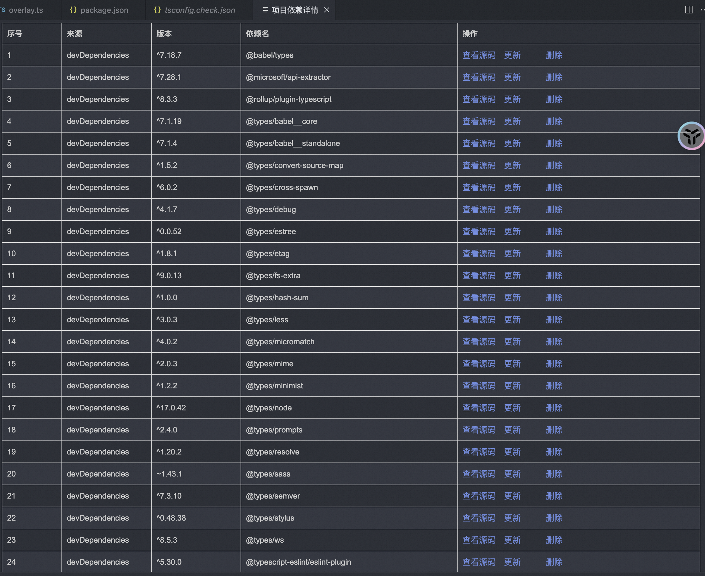

# vscode-plugin-utils说明

插件集合

## 依赖包管理

工程项目安装完依赖之后，选中package.json文件， 右键 “项目依赖包”

## For more information

* [Visual Studio Code's Markdown Support](http://code.visualstudio.com/docs/languages/markdown)
* [Markdown Syntax Reference](https://help.github.com/articles/markdown-basics/)

**Enjoy!**
